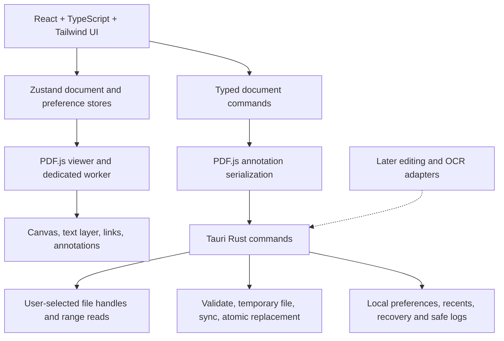

# NavPDF architecture

## Scope and sequencing

The accepted product specification is stored verbatim in [docs/PRODUCT-SPEC.txt](docs/PRODUCT-SPEC.txt).
The current September 14 implementation status and open acceptance gates are recorded in [docs/DELIVERY-PHASES.md](docs/DELIVERY-PHASES.md) and [docs/VERIFICATION.md](docs/VERIFICATION.md).
Its final instruction is to implement Phase 1 first, then progress through the remaining phases only after the reader foundation is proven.
This milestone implements the Tauri reader and the additional persisted-highlight acceptance journey explicitly requested at the end of that specification.
The earlier Electron/Python prototype is preserved in Git history; it is not the architecture or feature-completion evidence for this implementation.

## System architecture

There is no production HTTP server, Python interpreter, Electron runtime, cloud account or remote document service.
Tauri uses the operating system webview.
The frontend can request bytes only through opaque handles created after a native file selection.
External URLs, PDF scripting, attachment launching and remote navigation are not enabled.

## Rendering and data flow

The native picker opens a PDF and returns an opaque document identifier, its display name and its length.
PDF.js requests bounded byte ranges through binary Tauri IPC, keeping raw file paths and unrestricted filesystem access out of the renderer.
The loaded document is owned by a document session service, separate from serializable Zustand UI state.
PDF.js parses in a dedicated worker and provides the text layer, annotation layer, links, selection, page labels and outlines.
Its maintained viewer rendering queue and page buffer render nearby pages, release distant canvases and preserve text correctness across page rotations and dimensions.
The thumbnail sidebar is independently virtualized and never mounts a thousand canvases.
A maximum canvas pixel budget bounds high-DPI and 500% zoom rendering.

Continuous, single-page and two-page layouts use the same viewer instance.
Fit page, fit width and 25% through 500% zoom are explicit states.
Native page navigation and internal PDF links use the PDF.js link service.
PDF JavaScript is never executed.

## Search

The PDF.js find controller indexes native and OCR text in its worker-supported extraction path.
Search supports case sensitivity, whole words, count, page-numbered results and context.
The result list is bounded independently from the document index.
Selecting a result navigates to its page and highlights the match.
Search requests are cancelled or superseded when the document changes.

## PDF editing strategy

Phase 1 uses PDF.js's standard highlight annotation editor and its incremental PDF serialization.
A highlight is written into the PDF, not retained only as an overlay or app database entry.
The native layer validates serialized output with the permissively licensed Rust `lopdf` parser before any target is replaced.
Encrypted PDFs can be read after entering the password; annotation saving to encrypted documents is deliberately not enabled until the encryption-preserving editing path is verified in a later phase.

The editing boundary accepts typed commands with explicit capabilities and preserves the current source until a successful save.
pdf-lib remains behind domain helpers for annotations, forms, page composition, decorations, OCR layers and metadata.
The Rust lopdf engine owns protection, compression, existing-object edits, redaction and certificate signing.
No library is assumed to support arbitrary existing-text reflow or secure redaction merely because it can draw on a page.
The maintenance boundary and exit path are recorded in [ADR 0011](docs/adr/0011-pdf-lib-maintenance-and-exit.md).
MuPDF requires a separate redistribution decision and is not bundled into this permissive foundation.

## Undo and redo

The PDF.js annotation editor provides its native undo and redo state, while the controller serializes document mutations through `MutationQueue`.
The session also records bounded revision snapshots for local undo and redo of pdf-lib and native engine operations.
History is session-local, and a document replacement must not silently discard unsaved edits.

## File saving and recovery

Save writes to the current user-selected path; Save As obtains a separate native destination.
Before replacing a target, Rust parses the output, verifies the expected page count, writes a temporary file in the target directory, flushes it and atomically persists it.
Failed validation or writing retains the original file.
Save detects an externally changed source rather than overwriting it silently.
PDF.js reads from an immutable source snapshot during the session, preventing later range reads from mixing original and rewritten data.

Recovery is an encrypted-PDF-aware local service boundary.
For this milestone, unencrypted highlight edits can be recovered from a private application-data snapshot if recovery is enabled.
Recovery never saves a decrypted copy of a password-protected source.
A successful full save clears the recovery entry.
The home screen exposes recovery explicitly instead of restoring a document without the user's knowledge.

## OCR strategy

macOS OCR invokes Apple Vision through the native `AppleVisionEngine` and returns text, bounding boxes, language, orientation and confidence.
The browser preview and unsupported platforms report that the local engine is unavailable.
The acceptance corpus measures word error rate, character error rate and box geometry instead of substituting fixed sample text.
OCR results become invisible PDF text rather than replacing scans with visible recognized text.
The current environment still has an open native OCR gate because the six generated samples returned no recognized text.

## Security and privacy

Production content security policy permits bundled assets, local worker resources and Tauri IPC only.
No HTTP client plugin, shell plugin, arbitrary file-read command, external opener or remote font/CDN is exposed.
Network access defaults to off and remains unavailable in this milestone.
Native navigation handlers reject external destinations and PDF scripting remains disabled.
Native commands validate identifiers, ranges, size limits, destination selection and document lifecycle.
Passwords remain in memory and are excluded from logs, preferences, recovery and recent-file metadata.
The logs record timestamp, severity, component, operation and a native backtrace on save errors, never document text or document filesystem paths.

Preferences and recent document paths stay in private local application data.
Users can disable recents and clear their history.
Signature storage and cryptographic signing have separate future service boundaries and are not represented by fake controls in this milestone.

## Performance model

The PDF file is not rasterized into memory.
The viewer retains a bounded nearby-page canvas buffer, thumbnails are virtualized, and byte transfers are bounded range reads.
Rendered canvas memory is capped per page and cancelled on document replacement or zoom changes.
Search extraction is asynchronous; indexing progress is visible and stale results are ignored.
Native file and PDF-validation work runs outside the webview UI thread.
Fixtures cover 5, 100, 500 and 1,000 pages, rotated pages, mixed sizes, forms, annotations, damaged files, password protection, embedded fonts and image-heavy scans.
Performance evidence reports measured time and live canvas counts separately from subjective scrolling quality.

## Library decisions

| Library | License and maintenance evidence | Role and tradeoff |
| --- | --- | --- |
| Tauri 2 | MIT/Apache-2.0; actively maintained desktop framework | Rust shell using WKWebView on macOS, portable architecture for WebView2 and WebKitGTK. |
| PDF.js / pdfjs-dist 6.3.289 | Apache-2.0; package updated August 2026 | Adopt for rendering, text, search and verified annotation persistence; all assets bundled locally. |
| lopdf | MIT; current Rust library | Adopt for structural validation of saved PDFs, not rendering or arbitrary text layout. |
| qpdf | Apache-2.0; maintained native C++ project | Not selected for the current native engine boundary. |
| PDFium | BSD-style core with third-party notices; maintained in Chromium ecosystem | Deferred because the lopdf engine now owns the required native mutation paths. |
| pdf-lib 1.17.1 | MIT; stale release cadence and encryption limitations | Bounded writer for annotations, forms, page composition, decorations, OCR layers and metadata under ADR 0011. |
| lopdf | MIT; current Rust library | Native structural validation and engine for protection, compression, edits, redaction and signing. |
| MuPDF / PyMuPDF | AGPL or commercial licensing | Strong editing/redaction engine, but excluded from the new distributable until licensing is deliberately resolved. |
| Tesseract | Apache-2.0; maintained, cross-platform OCR | Portable OCR candidate requiring language assets and measured scan accuracy. |
| OCRmyPDF | MPL-2.0 application plus separately licensed dependencies | Mature OCR pipeline reference; distribution and subprocess complexity exceed the Phase 1 need. |
| Apple Vision | Apple system framework and platform SDK terms | macOS OCR candidate; not portable and not presumed superior without fixture-based evaluation. |

## Sources

- [Tauri architecture and platform model](https://v2.tauri.app/start/)
- [Tauri IPC](https://v2.tauri.app/develop/calling-rust/)
- [Tauri CSP](https://v2.tauri.app/security/csp/)
- [PDF.js project and license](https://github.com/mozilla/pdf.js)
- [pdf-lib project and limits](https://github.com/Hopding/pdf-lib)
- [qpdf project](https://github.com/qpdf/qpdf)
- [PDFium license and third-party terms](https://pdfium.googlesource.com/pdfium/+/refs/heads/main/LICENSE)
- [MuPDF license](https://github.com/ArtifexSoftware/mupdf/blob/master/COPYING)
- [Tesseract project](https://github.com/tesseract-ocr/tesseract)
- [OCRmyPDF project](https://github.com/ocrmypdf/OCRmyPDF)
- [Apple Vision text recognition](https://developer.apple.com/documentation/vision/recognizing-text-in-images)

## Webview compatibility

Before PDF.js initializes, a feature check loads the MIT-licensed web-streams-polyfill only when asynchronous stream iteration is absent.
This addresses the WebKit text-extraction incompatibility described in [PDF.js issue 20973](https://github.com/mozilla/pdf.js/issues/20973).
The local range adapter assembles each coalesced PDF.js request into one response while keeping individual native reads bounded.
PDF.js is pinned because exact occurrence navigation synchronizes its exposed search cursor, which is covered by an integration test against that version.

## Known milestone limitations

The September 14 worktree implements Tranches 0 through 3 in source and has started Tranche 5 with metadata editing.
Native rendering, DMG customization, independent-reader acceptance, hosted CI and the remaining specification, parity and memory tranches remain open.
Arbitrary existing-text reflow, certified signatures, Acrobat parity and machine-relative memory budgets are not claimed as complete.
A signed and notarized public installer requires a valid distribution identity; a local macOS app can be built and tested without claiming notarization.
Cross-platform architecture does not imply Windows or Linux runtime acceptance has been performed.
